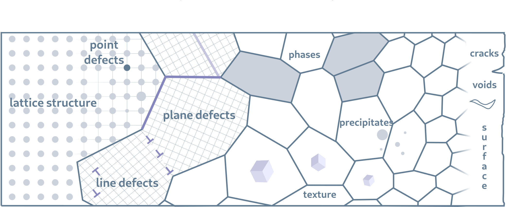

## Crystallographic Defect Ontology Suite

The Open Crystallographic Defects Ontologies is an initiative that aims to develop standard and interoperable semantics describing crystal defects in materials.

#### Crystallographic Defect Core Ontology - cdco
 * iri: http://purls.helmholtz-metadaten.de/cdos/cdco
 * https://github.com/OCDO/cdco
 * 📄 https://ocdo.github.io/cdco/

#### Point Defect Ontology - podo
 * iri: http://purls.helmholtz-metadaten.de/cdos/podo
 * https://github.com/OCDO/podo
 * 📄 https://ocdo.github.io/podo/

#### Line Defect Ontology - ldo
 * iri: http://purls.helmholtz-metadaten.de/cdos/ldo
 * https://github.com/OCDO/ldo
 * 📄 https://ocdo.github.io/ldo/

#### Plane Defect Ontology - pldo
 * iri: http://purls.helmholtz-metadaten.de/cdos/pldo
 * https://github.com/OCDO/pldo
 * 📄 https://ocdo.github.io/pldo/
 
