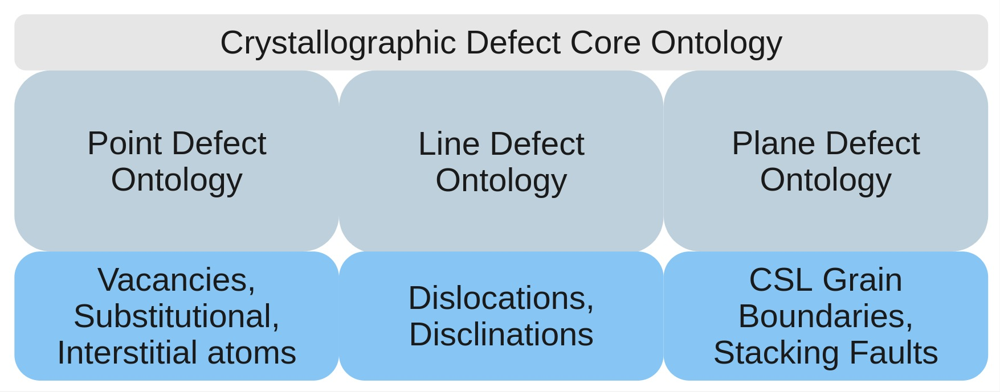
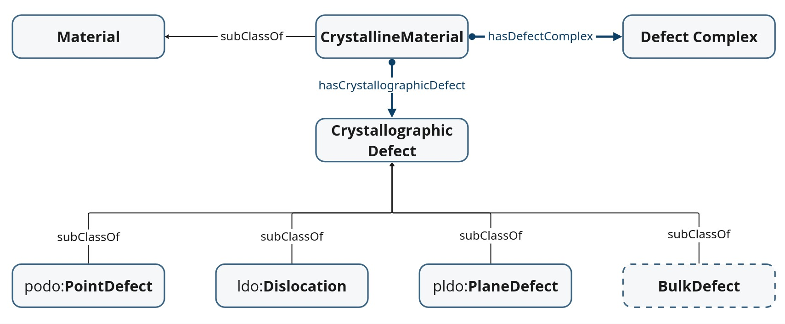
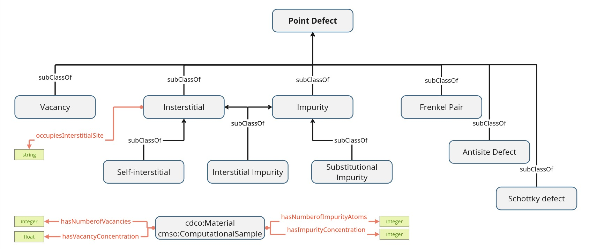
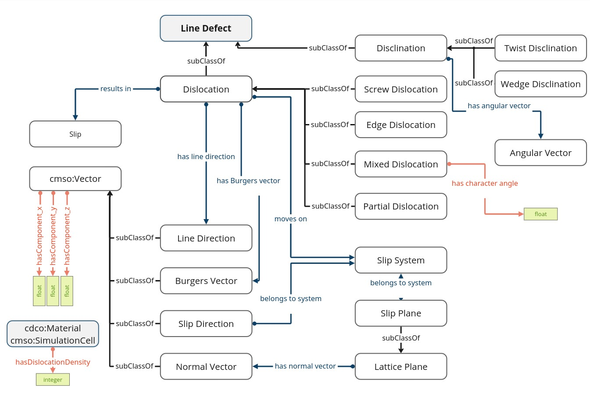
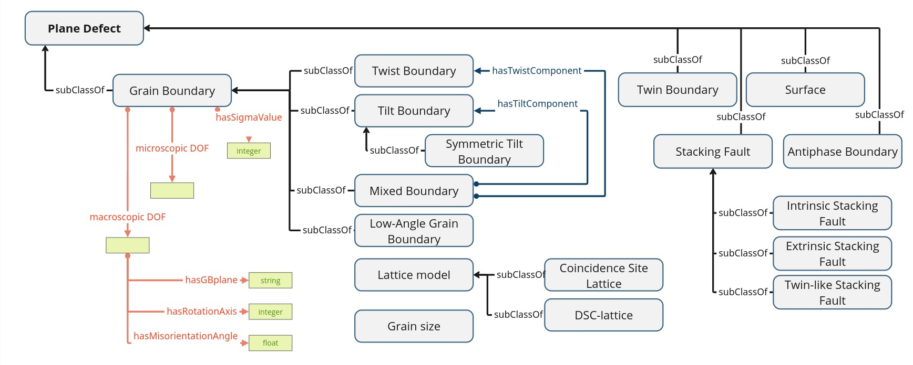

## Ontologies

CDOS contains the ontologies that describe crystallographic defects, following a modular approach according to the common classification of defects.

### Overview

#### Crystallographic Defect Ontology Suite - cdos

#### Crystallographic Defect Core Ontology - cdco
 * iri: http://purls.helmholtz-metadaten.de/cdos/cdco
 * repo:https://github.com/OCDO/cdco
 * docs: https://ocdo.github.io/cdco/

#### Point Defect Ontology - podo
 * iri: http://purls.helmholtz-metadaten.de/cdos/podo
 * repo:https://github.com/OCDO/podo
 * docs: https://ocdo.github.io/podo/

 

#### Line Defect Ontology - ldo
 * iri: http://purls.helmholtz-metadaten.de/cdos/ldo
 * repo:https://github.com/OCDO/ldo
 * docs: https://ocdo.github.io/ldo/

 

#### Plane Defect Ontology - pldo
 * iri: http://purls.helmholtz-metadaten.de/cdos/pldo
 * repo:https://github.com/OCDO/pldo
 * docs: https://ocdo.github.io/pldo/

 